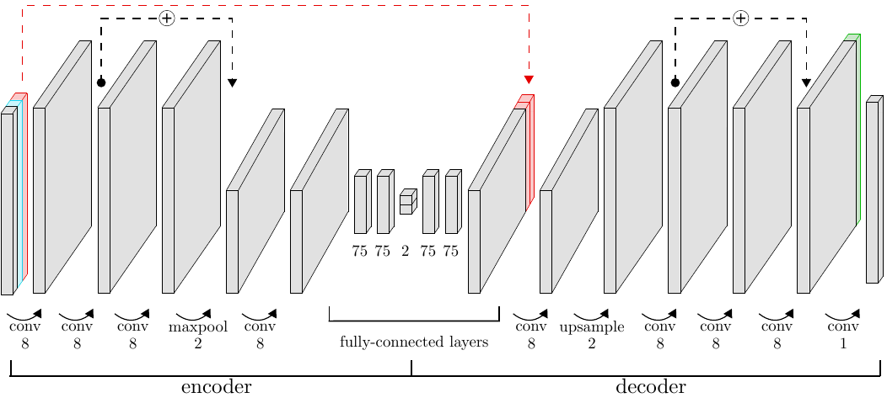
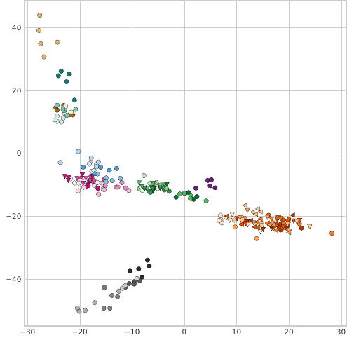
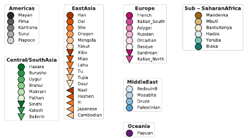

# GenoCAE

Convolutional autoencoder for genotype data, as described in [1]

An interactive version of the dimensionality reduction visualization from the paper can be found [here](https://www.kristiinaausmees.com/interactivevis).

## Installation

### Manual Installation
(examples for linux)

#### Requirements:

python >= 3.6

python3-dev

pip3

#### Install Python packages:


    $ cd GenoCAE/
    $ pip3 install -r requirements.txt

### Docker Installation

#### Build Docker image

``` Shell
docker build -t gcae/genocae:build -f docker/build.dockerfile .
```

#### CLI

```
$ docker run -it --rm -v ${PWD}:/workspace gcae/genocae:build python3 run_gcae.py --help

```

If you have a Docker with GPU support.
```
$ docker run -it  --gpus=all --rm -v ${PWD}:/workspace gcae/genocae:build python3 run_gcae.py --help

```

## CLI

The training and evaluation of models is wrapped by a command-line interface (CLI)


    $ cd GenoCAE/
    $ python3 run_gcae.py --help

    GenoCAE.

    Usage:
      run_gcae.py train --datadir=<name> --data=<name> --model_id=<name> --train_opts_id=<name> --data_opts_id=<name> --epochs=<num> [--resume_from=<num> --trainedmodeldir=<name> --patience=<num> --save_interval=<num> --start_saving_from=<num> ]
      run_gcae.py project --datadir=<name>   [ --data=<name> --model_id=<name>  --train_opts_id=<name> --data_opts_id=<name> --superpops=<name> --epoch=<num> --trainedmodeldir=<name>   --pdata=<name> --trainedmodelname=<name>]
      run_gcae.py plot --datadir=<name> [  --data=<name>  --model_id=<name> --train_opts_id=<name> --data_opts_id=<name>  --superpops=<name> --epoch=<num> --trainedmodeldir=<name>  --pdata=<name> --trainedmodelname=<name>]
      run_gcae.py animate --datadir=<name>   [ --data=<name>   --model_id=<name> --train_opts_id=<name> --data_opts_id=<name>  --superpops=<name> --epoch=<num> --trainedmodeldir=<name> --pdata=<name> --trainedmodelname=<name>]
      run_gcae.py evaluate --datadir=<name> --metrics=<name>  [  --data=<name>  --model_id=<name> --train_opts_id=<name> --data_opts_id=<name>  --superpops=<name> --epoch=<num> --trainedmodeldir=<name>  --pdata=<name> --trainedmodelname=<name>]

    Options:
      -h --help             show this screen
      --datadir=<name>      directory where sample data is stored. if not absolute: assumed relative to GenoCAE/ directory. DEFAULT: data/
      --data=<name>         file prefix, not including path, of the data files (EIGENSTRAT of PLINK format)
      --trainedmodeldir=<name>     base path where to save model training directories. if not absolute: assumed relative to GenoCAE/ directory. DEFAULT: ae_out/
      --model_id=<name>     model id, corresponding to a file models/model_id.json
      --train_opts_id=<name>train options id, corresponding to a file train_opts/train_opts_id.json
      --data_opts_id=<name> data options id, corresponding to a file data_opts/data_opts_id.json
      --epochs<num>         number of epochs to train
      --resume_from<num>	saved epoch to resume training from. set to -1 for latest saved epoch. DEFAULT: None (don't resume)
      --save_interval<num>	epoch intervals at which to save state of model. DEFAULT: None (don't save)
      --start_saving_from<num>	number of epochs to train before starting to save model state. DEFAULT: 0.
      --trainedmodelname=<name> name of the model training directory to fetch saved model state from when project/plot/evaluating
      --pdata=<name>     	file prefix, not including path, of data to project/plot/evaluate. if not specified, assumed to be the same the model was trained on.
      --epoch<num>          epoch at which to project/plot/evaluate data. DEFAULT: all saved epochs
      --superpops<name>     path+filename of file mapping populations to superpopulations. used to color populations of the same superpopulation in similar colors in plotting. if not absolute path: assumed relative to GenoCAE/ directory.
      --metrics=<name>      the metric(s) to evaluate, e.g. hull_error of f1 score. can pass a list with multiple metrics, e.g. "f1_score_3,f1_score_5". DEFAULT: f1_score_3
      --patience=<num>	 	stop training after this number of epochs without improving lowest validation. DEFAULT: None

The main commands are:

1. **train:** train model, and save its state at certain epochs to disk.
2. **project:** load saved model state, run data through it and save the projected data to disk.

Once projected data has been written to disk, the following commands can be used:

3. **plot:** create plots of the projected data
4. **animate:** create an animation visualizing the projected data at different epochs
5. **evaluate:** calculate specified metrics for the projected data


> See the [Examples](#examples) section below for examples of running these commands.

## Setup training

Setup requires defining the following (using the CLI options):

1. data
2. data options
3. model
4. training options

### data

Defines the actual samples and genotype data to use. Passed to the CLI with option **--data**

Accepted data formats are

* EIGENSTRAT (eigenstratgeno/snp/ind). Details [here](https://reich.hms.harvard.edu/software/InputFileFormats)
* PLINK (bed/bim/fam). Details [here](https://www.cog-genomics.org/plink/1.9/input#bed)


A small example data set **HumanOrigins249_tiny** is in  [example_tiny/](example_tiny/) with 249 samples and 9259 SNPs. This can be used for local testing.

### data options

These options affect how data is input to the model. Passed to the CLI with option **--data_opts**, specifying a json file in the directory [data_opts/](data_opts/)

Example: ([data_opts/b_0_4.json](data_opts/b_0_4.json))

    { "norm_mode" : "genotypewise01",
      "norm_opts" : {"flip": false, "missing_val":-1.0},
      "impute_missing" : true,
      "validation_split" : 0.2,
      "sparsifies" : [0.0, 0.1, 0.2, 0.3, 0.4]
     }


* **norm_mode:** what normalization mode to use (**genotypewise01**, **smartPCAstyle** or **standard**)
* **norm_opts:** additional normalization options:

    * **missing_val:** value to use to encode missing data in model input (only applicable if either sparsifies is specified, or the original data contains missing genotypes and impute_missing = False )
    * **flip:** whether or not to flip genotype labels 0-1-2 → 2-1-0

* **impute_missing:** if true, genotypes that are missing in the original data are set to the most frequent genotype per marker. if false, then the genotypes that were originally missing are ignored when calculating the loss and genotype concordance. **NOTE** if this is set to False, then **missing_val** should be given a value that cannot occur in the data after normalization, so the model can correctly identify which genotypes were originally missing.
* **validation_split:** fraction of samples to use as validation set

Optional:
* **sparsifies:** list of fractions of data to remove artificially during the training process, for regularization


#### normalization methods
> **genotypewise01:** normalize genotypes to range \[0-1\] by mapping 0,1,2 -> 0.0,0.5,1.0

> **smartPCAstyle:** subtract mean and divide with an estimate of the std of population allele frequency (more info in the [EIGENSTRAT paper](https://www.ncbi.nlm.nih.gov/pmc/articles/PMC1713260/)), results in data that is centered and has close to unit variance

> **standard:** subtract mean and divide with std

### model
This defines a model architecture. Passed to the CLI with option **--model_id**, specifying a json file in the directory [models/](models/). The json file defines what layers the model should have, in what order, convolution, stride, pool size etc.

Example model: ([models/M1.json](models/M1.json))


    {"layers":
    [
      {"class": "Conv1D", "module":"tf.keras.layers", "args": {"filters":8, "kernel_size":5, "padding":"same", "activation":"elu", "strides":1}},
      {"class": "BatchNormalization", "module":"tf.keras.layers", "args": {}},
      {"class": "ResidualBlock2", "module":"utils.layers", "args": {"filters":8, "kernel_size":5}},
      {"class": "MaxPool1D", "module":"tf.keras.layers", "args": {"pool_size":5, "strides":2, "padding":"same"}},
      {"class": "Conv1D", "module":"tf.keras.layers", "args": {"filters":8, "kernel_size":5, "padding":"same", "activation":"elu"}},
      {"class": "BatchNormalization", "module":"tf.keras.layers", "args": {}},
      {"class": "Flatten", "module":"tf.keras.layers", "args": {}},
      {"class": "Dropout", "module":"tf.keras.layers", "args": {"rate":0.01}},
      {"class": "Dense", "module":"tf.keras.layers", "args": {"units":75}},
      {"class": "Dropout", "module":"tf.keras.layers", "args": {"rate":0.01}},
      {"class": "Dense", "module":"tf.keras.layers", "args": {"units":75, "activation":"elu"}},
      {"class": "Dense", "module":"tf.keras.layers", "encoding" : true, "args": {"units":2, "name":"encoded"}},
      {"class": "Dense", "module":"tf.keras.layers", "args": {"units":75, "activation":"elu"}},
      {"class": "Dropout", "module":"tf.keras.layers", "args": {"rate":0.01}},
      {"class": "Dense", "module":"tf.keras.layers", "args": {"units":75, "activation":"elu"}},
      {"class": "Dropout", "module":"tf.keras.layers", "args": {"rate":0.01}},
      {"class": "Dense", "module":"tf.keras.layers", "args": {"units":"ns[1]*8"}},
      {"class": "Reshape", "module":"tf.keras.layers", "args": {"target_shape":"(ns[1],8)", "name":"i_msvar"}},
      {"class": "Conv1D", "module":"tf.keras.layers", "args": {"filters":8, "kernel_size":5, "padding":"same", "activation":"elu"}},
      {"class": "BatchNormalization", "module":"tf.keras.layers", "args": {}},
      {"class": "Reshape", "module":"tf.keras.layers", "args": {"target_shape":"(ns[1],1,8)"}},
      {"class": "UpSampling2D", "module":"tf.keras.layers", "args": {"size":"(2,1)"}},
      {"class": "Reshape", "module":"tf.keras.layers", "args": {"target_shape":"(ns[1]*2,8)"}},
      {"class": "ResidualBlock2", "module":"utils.layers", "args": {"filters":8, "kernel_size":5}},
      {"class": "Conv1D", "module":"tf.keras.layers", "args": {"filters":8, "kernel_size":5, "padding":"same", "activation":"elu", "name":"nms"}},
      {"class": "BatchNormalization", "module":"tf.keras.layers", "args": {}},
      {"class": "Conv1D", "module":"tf.keras.layers", "args": {"filters":1, "kernel_size":1, "padding":"same"}},
      {"class": "Flatten", "module":"tf.keras.layers", "args": {"name":"logits"}}
    ]

    }

Corresponds to the below architecture:




* The layers are ordered top-bottom as they are left-right in the autoencoder.

* The middle layer should be given the name **"encoded"**, this indicates which layer is the latent representation, or encoding.

> **Marker-specific variables:** In order to facilitate the learning of global patterns in the input data, the there is the option to add so-called marker-specific variables. These contsist of one variable per marker that is updated during the optimization process, allowing the model to capture marker-specific behavior. The two sets of marker-specific variables are illustrated in the figure in red and green. The red set of variables is also concatenated to the model input at every stage of the training process.

* Giving a layer the name **"i_msvar"** denotes where the marker-specific variable that is red in the figure should be concatenated

* Giving a layer the name **"nms"** denotes where the marker-specific variable that is green in the figure should be concatenated

* The variable **"ns"** is a list that contains the size of the length dimension of the data (the dimension that corresponds to the length of the genetic sequence). When a layer that modifies this (e.g. maxpooling) in the encoder is added, the new length is added to **ns**, so that it can be used to reconstruct the lengths in the decoder (e.g. when upsamling). The values in **ns** will thus depend on the length of the input data. For the data **HumanOrigins249_tiny** which is used in the [Examples](#examples) section below, **ns=\[9259,4630\]**. When a layer argument such as "units" or "target_shape" that should be an int is specified as a string, it will be evaluated as a python expression (and should therefore be a valid expression that evaluates to an int).

### train options
These options affect the training of the model. Passed to the CLI with option **--train_opts**, specifying a json file in the directory [train_opts/](train_opts/)


Example with mean squared error loss: ([train_opts/ex1.json](train_opts/ex1.json))

    {
      "learning_rate": 0.000275,
      "batch_size": 100,
      "noise_std": 0.005,
      "n_samples": -1,
      "loss": {
        "module": "tf.keras.losses",
        "class": "MeanSquaredError"
      },
      "regularizer": {
        "reg_factor": 5e-08,
        "module": "tf.keras.regularizers",
        "class": "l2"
      },

    }


Example with binary cross-entropy loss: ([train_opts/ex2.json](train_opts/ex2.json))

    {
      "learning_rate": 0.000275,
      "batch_size": 100,
      "noise_std": 0.01,
      "n_samples": -1,
      "loss": {
        "module": "tf.keras.losses",
        "class": "BinaryCrossentropy",
        "args": {
          "from_logits": true
        }
      },
      "regularizer": {
        "reg_factor": 1.5e-07,
        "module": "tf.keras.regularizers",
        "class": "l2"
      }
    }


Example with categorical cross-entropy loss and a learning rate scheme: ([train_opts/ex3.json](train_opts/ex3.json))

    {
      "learning_rate": 3.2e-02,
      "batch_size": 100,
      "noise_std": 0.0032,
      "n_samples": -1,
      "loss": {
        "module": "tf.keras.losses",
        "class": "CategoricalCrossentropy",
        "args": {
        "from_logits": false}},
      "regularizer": {
        "reg_factor": 1.0e-07,
        "module": "tf.keras.regularizers",
        "class": "l2"
      },
    "lr_scheme": {
        "module": "tf.keras.optimizers.schedules",
        "class": "ExponentialDecay",
        "args": {
             "decay_rate": 0.98,
             "decay_steps": 100,
             "staircase": false}}
    }
* **learning rate:** learning rate
* **batch size:** batch size
* **noise_std:** std of noise to add to encoding layer, for regularization
* **n_samples:** : how many samples to use in training. if more than the specified data has, then they are repeated. makes most sense to use in combination with dats augmentation (sparsifies). -1 means use all train samples (after the validation set has been removed)
* **loss:** the loss function to use for reconstructed genotypes. specify module, class and arguments of the loss object. the given examples correspond to tensorflow loss classes. specifying one other than these 3, or making a custom class may require additional code changes.
* **regularizer:** how to regularize encoding so the values don't grow uncontrollably. also specifies an existing tensforflow class to use.
    * **reg_factor:** the regularization factor.

optional:

* **lr_scheme:** scheme to apply to learning rate. the example above is to use exponential decay, see [tf documentation](https://www.tensorflow.org/api_docs/python/tf/keras/optimizers/schedules/ExponentialDecay).


> if the loss is sigmoid_cross_entropy_with_logits, the normalized genotypes should be in range (0,1) - so normalized using e.g. genotypewise01

> if the loss is mean_squared_error, the normalized genotypes can be in any range, can use smartPCAstyle normalization

> normalization mode is specified in the data_opts file


### On saving model state

The training procedure saves the current state of the model in the directory weights/ in the training directory. Since these files can take up a significant amount of space, there are arguments to control how this is done:

* If specified, the model state is saved every **save_interval** epochs.

* If a validation set is used, whenever a minimum validation loss is encountered, the weights are saved, and the weights of the previously saved lowest validation epoch are deleted.

* For both of the above: the argument **start_saving_from** specifies a number of epochs to train before starting to save model state.

* When stopping training (either because the specified number of **epochs** has been reached, or because **patience** number of epochs have passed without reaching a new lowest validation loss), the current model state is saved.


## Examples

### Training
Command to train a model on the example data :

    $ cd GenoCAE/
    $ python3 run_gcae.py train --datadir example_tiny/ --data HumanOrigins249_tiny --model_id M1  --epochs 20 --save_interval 2  --train_opts_id ex3  --data_opts_id b_0_4


This creates a model training directory: **ae_out/ae.M1.ex3.b_0_4.HumanOrigins249_tiny/** with subdirectories
* train/: tensorboard statistics for the train set
* valid/: tensorboard statistics for the valid set
* weights/: files containing saved model states

The following files are also created:
* train_times.csv: time in seconds to train each epoch
* losses_from_train_t.csv: loss function value on the training set per epoch
* losses_from_train_v.csv: loss function value on the validation set per epoch


You can [install tensorboard](https://pypi.org/project/tensorboard/) to use their suite of web tools for inspecting TensorFlow runs.


Tensorboard can be started using:

    $ tensorboard --logdir ae_out/ae.M1.ex3.b_0_4.HumanOrigins249_tiny/

it will be displayed on localhost:6006 in the browser


### Projecting

The saved model weights in a model training directory are used to reload the model at each epoch, and project a given data set (= calcaulate the encoding / latent representation). The entire given data set is projected, no validation set is defined.

> The data set to project is specified using the **pdata** argument. If not specified, the same set as was used for training is assumed.


    $ cd GenoCAE/
    $ python3 run_gcae.py project --datadir example_tiny/ --data HumanOrigins249_tiny --model_id M1 --train_opts_id ex3  --data_opts_id b_0_4 --superpops example_tiny/HO_superpopulations

This creates a directory named after the projected data containing:

1. a file **encoded_data.h5** containing the projected data (= the encoded data) for all samples at each epoch. this file is used by the plot, evaluate and animate commands.
2. for each saved epoch: a plot of the projected samples colored according to population, and if specified, superpopulation. a legend is written to a separate file.
3. a plot and csv file of the **loss function value** of the model per epoch. note that this is the loss for the entire data set.
4. a plot and csv file of the **genotype concordance** of the model per epoch (this is the rate that the model output is equal to the model input). the black line shows the baseline genotype concordance, given by guessing the most frequently occurring genotype per marker.
5. a plot **true_genotypes.pdf** showing a histogram of the true (input) genotypes that the model is trained on
6. a plot **output_as_genotypes.pdf** showing a histogram of the model output interpreted as genotypes, for the last epoch


> When projecting/plotting/evaluating: the location to look for a trained model can either be specified with the same options given to the train commamd (model_id, data_opts_id, etc.) OR by giving the entire directory name with the --trainedmodelname argument.
> e.g.

    $ cd GenoCAE/
    $ python3 run_gcae.py project --datadir example_tiny/  --trainedmodelname ae.M1.ex3.b_0_4.HumanOrigins249_tiny --superpops example_tiny/HO_superpopulations


### Plotting

The encoded data per epoch that is stored in the file **encoded_data.h5** created by the project command is plotted (generating the same plots as the project command).

    $ cd GenoCAE/
    $ python3 run_gcae.py plot --datadir example_tiny/ --trainedmodelname ae.M1.ex3.b_0_4.HumanOrigins249_tiny --superpops example_tiny/HO_superpopulations


### Animating

An animation visualizing the dimensionality reduction over the saved epochs **encoded_data.h5** is created.

    $ cd GenoCAE/
    $ python3 run_gcae.py animate --datadir example_tiny/ --trainedmodelname ae.M1.ex3.b_0_4.HumanOrigins249_tiny --superpops example_tiny/HO_superpopulations


### Evaluating

The encoded data per epoch that is stored in the file **encoded_data.h5** created by the project command is used to calculate various metrics. The metrics
are passed using the --metrics option. Currently implemented metrics are hull_error and f1_score_k, both of which are a measure of how well the encoding
clusters populations.

    $ cd GenoCAE/
    $ python3 run_gcae.py evaluate --metrics "hull_error,f1_score_3" --datadir example_tiny/ --trainedmodelname ae.M1.ex3.b_0_4.HumanOrigins249_tiny  --superpops example_tiny/HO_superpopulations


For each metric, a csv and pdf plot of the metric (averaged over all populations) per epoch is created.

For f1-scores, a csv file with the per-population f1-score is also created, one file per epoch.

**metrics:**

* **hull_error:** for every population p: define the convex hull created by the points of samples of p. calculate the fraction that other population's samples make up of all the points inside the hull. the hull error is the average of this over populations.

* **f1_score_k:** define a k-NN model for population classification based on the dimensionality reduction. get the f1-score of the classification model, micro-averaged over populations.


### Example results

Dimensionality reduction:



Legend:



## Getting started

See [tips](tips.md) for some rules of thumb for model architecture settings and hyperparameter tuning that might be a good place to start for using GCAE on your own data.


## References

 * [1] Kristiina Ausmees, Carl Nettelblad, A deep learning framework for characterization of genotype data, G3 Genes|Genomes|Genetics, 2022;, jkac020, [https://doi.org/10.1093/g3journal/jkac020](https://doi.org/10.1093/g3journal/jkac020)

